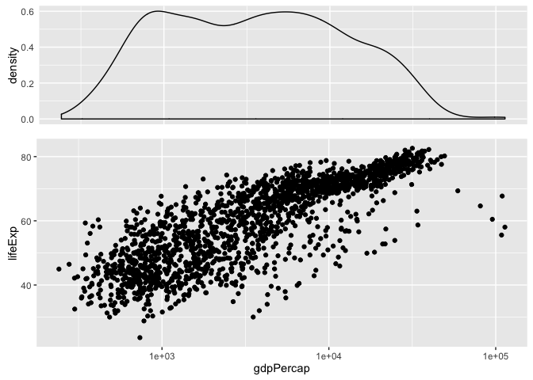

# Multiple plots on a page


### Facetting is not a panacea

Facetting is useful for constructing an array of similar plots where each panel corresponds to a level of a factor or a combination of levels from multiple factors. Pragmatic reshaping can make lots of graphing problems have this "look". But this does not cover the entire spectrum of multi-plot needs in the real world. Sometimes you need to get more than one plot on a virtual page and the plots are rather disconnected. How do you do that?

### Meet the gridExtra package

Under the hood, `ggplot2` uses the `grid` package to create figures. The `gridExtra` packages provides some extra goodies and we will draw on them to place multiple `ggplot2` plots on a single virtual page.

You may need to install `gridExtra` and you will certainly need to load it.


```r
# install.packages("gridExtra")
library(gridExtra)
```

### Load the Gapminder data and ggplot2


```r
library(gapminder)
library(ggplot2)
```

### Use the `arrangeGrob()` function and friends

Store the constituent plots to plot objects and then pass them to `grid.arrange()` or `arrangeGrob()`.


```r
p_dens <- ggplot(gapminder, aes(x = gdpPercap)) + geom_density() + scale_x_log10() +
  theme(axis.text.x = element_blank(),
        axis.ticks = element_blank(),
        axis.title.x = element_blank())
p_scatter <- ggplot(gapminder, aes(x = gdpPercap, y = lifeExp)) +
  geom_point() + scale_x_log10()
#p_both <- arrangeGrob(p_dens, p_scatter, nrow = 2, heights = c(0.35, 0.65))
#print(p_both)
grid.arrange(p_dens, p_scatter, nrow = 2, heights = c(0.35, 0.65))
```

<!-- -->

You can find other examples of this workflow in the [R Graph Catalog](http://shinyapps.stat.ubc.ca/r-graph-catalog/).

### Use the `multiplot()` function

In his [Cookbook for R](http://www.cookbook-r.com), Winston Chang uses the `grid` package to define the `multiplot()` function:


```r
# Multiple plot function
#
# ggplot objects can be passed in ..., or to plotlist (as a list of ggplot objects)
# - cols:   Number of columns in layout
# - layout: A matrix specifying the layout. If present, 'cols' is ignored.
#
# If the layout is something like matrix(c(1,2,3,3), nrow=2, byrow=TRUE),
# then plot 1 will go in the upper left, 2 will go in the upper right, and
# 3 will go all the way across the bottom.
#
multiplot <- function(..., plotlist=NULL, file, cols=1, layout=NULL) {
  require(grid)

  # Make a list from the ... arguments and plotlist
  plots <- c(list(...), plotlist)

  numPlots = length(plots)

  # If layout is NULL, then use 'cols' to determine layout
  if (is.null(layout)) {
    # Make the panel
    # ncol: Number of columns of plots
    # nrow: Number of rows needed, calculated from # of cols
    layout <- matrix(seq(1, cols * ceiling(numPlots/cols)),
                    ncol = cols, nrow = ceiling(numPlots/cols))
  }

 if (numPlots==1) {
    print(plots[[1]])

  } else {
    # Set up the page
    grid.newpage()
    pushViewport(viewport(layout = grid.layout(nrow(layout), ncol(layout))))

    # Make each plot, in the correct location
    for (i in 1:numPlots) {
      # Get the i,j matrix positions of the regions that contain this subplot
      matchidx <- as.data.frame(which(layout == i, arr.ind = TRUE))

      print(plots[[i]], vp = viewport(layout.pos.row = matchidx$row,
                                      layout.pos.col = matchidx$col))
    }
  }
}
```

Assuming that the plot objects `p1`, `p2`, `p3`, and `p4` are pre-defined, call the function like this:


```r
multiplot(p1, p2, p3, p4, cols = 2)
```

Visit [Multiple graphs on one page (ggplot2)](http://www.cookbook-r.com/Graphs/Multiple_graphs_on_one_page_(ggplot2)/) to see a complete worked example.

### Use the `cowplot` package

The `cowplot` package (on [CRAN](https://cran.r-project.org/web/packages/cowplot/index.html), on [GitHub](https://github.com/wilkelab/cowplot)) does (at least) two things:

  * Provide a publication-ready theme for `ggplot2`
  * Helps combine multiple plots into one figure

Check out [the vignette](https://cran.r-project.org/web/packages/cowplot/vignettes/introduction.html) to see it in action.
